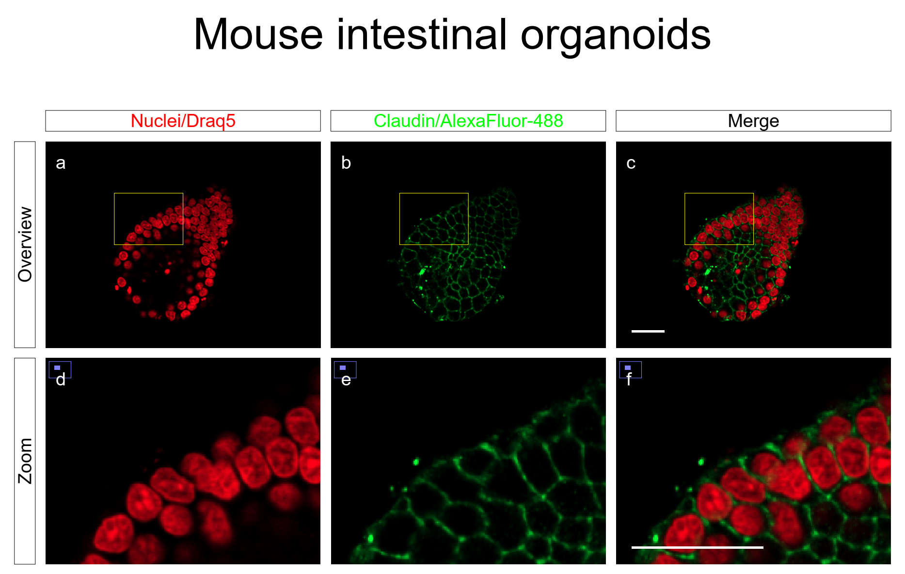

# nlFigure

## Motivation
Scientific figures are typically assembled interactively in dedicated layout software (e.g.
[Inkscape](https://inkscape.org), [Adoble Illustrator](https://www.adobe.com), 
[ScientiFig](https://scientifig.com), [FigureJ](https://imagej.net/plugins/figurej) or
[OMERO.figure](https://www.openmicroscopy.org/omero/figure/)).

In nlFigure, a novel plugin for [Fiji](https://fiji.sc), figures are not composed interactively, but based on
textual instructions, which helps to automate the workflow and guarantees reproducibility, while still remaining
intuitive to use. nlFigure is based on [nlScript](https://github.com/nlScript/nlScript-java).



```
Set the title text to 'Mouse intestinal organoids'.
Layout panels to make all rows the same height.
...
(see below)
```

## Installation
Download [nlFigure](https://github.com/nlScript/nlFigure/releases/download/v0.2.0/nlFigure-0.2.0.jar) from the
[GitHub release page](https://github.com/nlScript/nlFigure/releases), copy it to the plugins folder inside your
Fiji installation and restart Fiji.

## Features

### Document layout
- Set the document size
- Set the document borders
- Add a figure title
- Change the font, size and color of the title
- Add row and color headings
- Change font, size, color, background and frame of the headings
- Vector graphics output (PDF)

### Image display
- Display image titles
- Change image title position, font and color
- Display and style image frames
- Display and style image scalebars

### Panel display
- Automatically layout panels to fit the page width or the page height
- Automatically label panels with different numbering schemes
- Style labels
- Display panel frames

### Image manipulation
- Select the plane, channel(s) and timepoint of an image
- Adjust the field of view of an image
- Draw a rectangle into an image
- Automatically draw image overlays
- Automatically draw image selections (regions of interest - ROIs)
- Clear or hide image overlays


## Demo
To generate the figure displayed at the top of the page:
- Download the demo image: [organoid.tif](https://github.com/nlScript/nlFigure/releases/download/v0.2.0/organoid.tif)
- Start Fiji
- Open the demo image by dragging it into the Fiji window
- Run the `nlFigure` command (`>Plugins>nlFigure`)
- Paste the text below into the text field
- Click on `Run`.

```
Set the title text to 'Mouse intestinal organoids'.
Layout panels to make all rows the same height.
Set the image title invisible.
Modify image 'organoid.tif' to clear the overlay.
Set the panel label color to white.

Set the headings text color to red.
Set the headings text of column 1 to 'Nuclei/Draq5'.
Set the headings text color to green.
Set the headings text of column 2 to 'Claudin/AlexaFluor-488'.
Set the headings text color to black.
Set the headings text of column 3 to 'Merge'.

Set the headings text of row 1 to 'Overview'.
Set the headings text of row 2 to 'Zoom'.


Modify image 'organoid.tif' to limit the field of view to (800 x 600) at (0, 0).
Modify image 'organoid.tif' to show a 200 x 150 rectangle at (200, 150).


Modify image 'organoid.tif' to display channels 1.
Add image 'organoid.tif' to panel (1, 1) matching the panel size.

Modify image 'organoid.tif' to display channels 2.
Add image 'organoid.tif' to panel (1, 2) matching the panel size.

Set the image scalebar length to 20.
Set the image scalebar visible.
Modify image 'organoid.tif' to display channels 1, 2.
Add image 'organoid.tif' to panel (1, 3) matching the panel size.
Set the image scalebar invisible.


Modify image 'organoid.tif' to limit the field of view to (200 x 150) at (200, 150).
Modify image 'organoid.tif' to clear the overlay.

Modify image 'organoid.tif' to display channels 1.
Add image 'organoid.tif' to panel (2, 1) matching the panel size.

Modify image 'organoid.tif' to display channels 2.
Add image 'organoid.tif' to panel (2, 2) matching the panel size.

Set the image scalebar visible.
Modify image 'organoid.tif' to display channels 1, 2.
Add image 'organoid.tif' to panel (2, 3) matching the panel size.
```

## License
This project is licensed under the AGPL License - see the [LICENSE.txt](LICENSE.txt) file for details.

nlFigure depends on itextpdf. itextpdf is selectively licensed under the
[ALGPL-3.0 License](https://www.gnu.org/licenses/agpl-3.0.txt).
